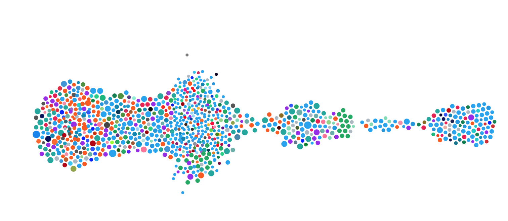

#  tech wont build it twitter visualization

I wanted to visualize tweets for a hashtag to browse the data in an easily scrubbable way through all of time.

## Local usage

Install node packages

```
npm install
```

Create a `.env` file in this folder. Create a Twitter application and set variables in the file accordingly:

```
TWITTER_CONSUMER_KEY=
TWITTER_CONSUMER_SECRET_KEY=
TWITTER_ACCESS_TOKEN=
TWITTER_ACCESS_TOKEN_SECRET=
```

Write IDs for the related tweets to a file

```
node get-ids.js
```

Get tweet data and save it to a file

```
node get-tweet-info.js
```

Open `visualization/index-2.html` for something like this with on-hover functionality:



